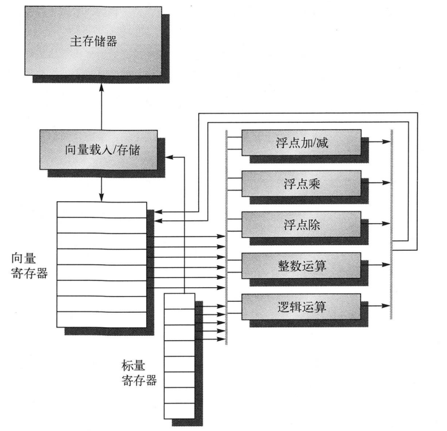

# 向量、SIMD和GPU体系结构中的数据级并行

## 1.向量体系结构

从存储器中获取数据元素集，并放在大型顺序寄存器堆中，对寄存器堆中的数据进行操作，然后结果放回存储器

**缺点：**

状态较大，即上下文切换时间较长。

### 1.1 RV64V扩展

RV64V主要组件：
* 1.向量寄存器（vector register）

    RV64V 有 32 个寄存器，每个位宽2048位，可以保存32个64位元素 -> 也可以拆成 `64 x 32` or `128 x 16`

* 2.向量功能单元（vector functional unit）

    需要控制单元检测冒险 

        * 1.功能单元的结构冒险
        * 2.寄存器访问的数据冒险

* 3.向量载入、存储单元（vector load/store unit）


* 4.标量寄存器集合（vector functional unit）   
    * a. 作为输入提供给向量功能单元
    * b. 计算传送给向量载入/存储单元的地址



**动态寄存器类型设定**：

1. 支持数据类型和位宽的多态性
2. 让程序禁用没有用到的向量寄存器，允许将所有的向量存储器分配给已启用的向量寄存器
3. 在不同大小的操作数之间进行转换时，可以利用寄存器的配置来隐式完成，而不需要增加额外的显示转换指令

#### vld & vst 指令

操作数1： 要载入或存储的向量寄存器

操作数2： 来自RV64G通用寄存器，表示向量在存储器的起始地址

* 向量长度寄存器 vl (载入或存储向量长度)
* 向量类型寄存器 vctype （记录寄存器类型）
* 谓词寄存器 pi （循环if）


### 1.2 向量处理器工作原理：

   ` Y = a * X + Y`

`X` 和 `Y` 为向量，最初保存在存储器中； `a` 是标量。 （SAXPY 和 DAXPY循环 ）

 SAXPY --> single-precision a * X plus Y

 DAXPY --> double-precision a * X plus Y

 (循环的迭代之间没有相关性：跨迭代相关， loop-carried dependence)

 链接（chaining） ： 将元素相关操作的`前递`

 ```asm

    vsetdcfg 4*FP64
    fld      f0,a
    vld      v0,x5
    vmul     v1,v0,f0
    vld      v2,x6
    vadd     v3,v1,v2
    vst      v3,x6
    vdisable
 ```

 ### 1.3 向量执行时间

 三个因素影响：

 1.操作数向量的长度

 2.操作之间的结构冒险

 3.多个向量操作间的数据依赖关系

 通道（lane）: 具备多条并行流水线的向量功能单元

 护航指令组（convoy）：一组可以一起执行的向量指令。不能包含任何结构冒险

 钟鸣（chime）：估计护航指令组的长度

 执行由 m 个护航指令组构成的向量序列需要 m 个钟鸣

### 1.4 多条通道：每个时钟周期处理多个元素
