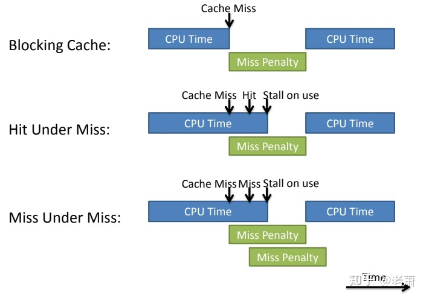

# Cache 存储器

参考网站指南：
[cache知乎详解](https://zhuanlan.zhihu.com/p/343870184)

# Contents
- [Memory Array](#heading-one)
- [Cache principle](#heading-two)
- [缓存器设计的四大问题](#heading-two)
- [缓存指标](#heading-two)


## 1.Memory Array

特点：
* 1.优化芯片面积
* 2.优化传播延迟
* 3.大的MUX-->分解成小的MUX

由于DRAM制造的内存缺点：
* 1.信号需要传递的更远，延迟增加
* 2.逻辑门增多，信号的扇出（Fan Out）变大，使得延迟增加

**Temporal Locality**:
```
if a location is reference it is likely to be reference again in the near future.
```

**Spatial Locality**；
```
if a location is reference it is likely that locations near it will be referenced in

the near future.
```

3 elements: 1.Instruction Fetchs 2.Stack Access  3.Data Access 

## 2.Cache principle
Address = Block address + Block offset

Block address = Tag + Index

## 3.缓存器设计的四大问题

* 1.Cache Placement
```
1.Direct Mapped --> 12 mod 8 = 4

2.Fully Associative --> anywhere

3.Set Associative --> 12 mod 4 = 0
```


* 2.Cache Searching
```
    只会比较 tag
```

* 3.Cache Replacement
```
1.随机替换
2.LRU替换
3.FIFO算法
```

* 4.Cache Write Policy
```
Write Through 写通
Write hit 后同时更新缓存器和主存

Write Back 写回
Write hit 后只更新缓存器，只有替换后才写回主存

Write Allocate 写分配
Write Miss 写进主存，并把写的数据放在缓存器

No-Write Allocate
Write Miss 写进主存，但不把数据写进缓存器

搭配：
way1: 写穿 & 写不分配 （Write Through & No-Write Allocate）
way2: 写回 & 写分配 （Write Back & Write Allocate）
```

## 4.缓存指标🤦‍♂️

平均内存访问时间 (Average Memory Access Time, AMAT)

`AMAT = Hit Time + Miss Rate * Miss Penalty`


# Non-blocking Cache （Out-of-order Cache, Lookup Free Cache）

核心思想 -> 出现 Cache Miss，后续的 Mem 指令依然执行

non-blocking 出现俩种情况



在只有Data Array和Tag Array的缓存中，缓存系统在遇到cache miss的情况下将不能接受新的load/store miss。这样的缓存系统叫做阻塞缓存。

阻塞缓存在乱序处理器中会阻止LSU （load/store unit）向其发出更多的存储或读取的访问，因此会影响整个处理器的运行速度。

为了解决这样的问题，我们引入一个叫做Miss Status Holding Registers (MSHRs)的结构来保存未解决的cache miss的信息。拥有MSHRs的缓存结构将可以接受多个cache miss，因此叫做非阻塞缓存 

要是MSHR满了就阻塞了。（MSHR不ready或者PutBuffer满了）