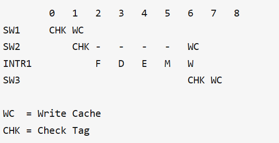
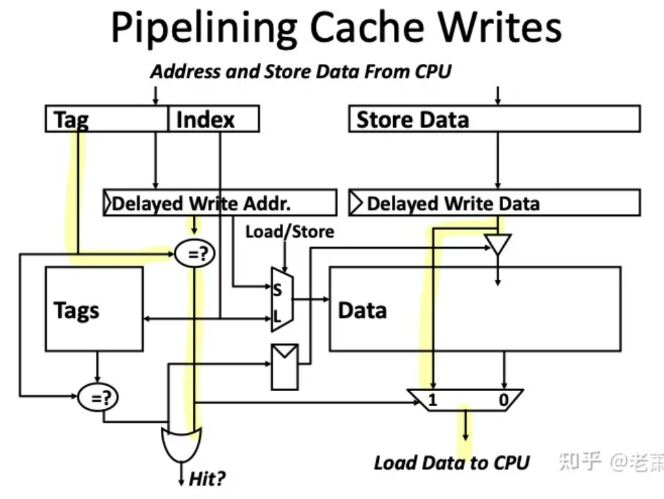

# architecture_store_optimize2

# Contents
- [1.高级优化方法一：缓存流水线化（Piplined Cache）](#heading-one)
- [2.高级优化方法二：内存写入缓冲区（Write Buffer）](#heading-two)


## 1.高级优化方法一：缓存流水线化（Piplined Cache）

将数据写入缓存 2 步：

* 1. 使用 Index 来定位 Tag Array (假设Tag Array 和 Data Array)

* 2. 检查有效位 Valid Bit 和标签 Tag, 如果 Tag 相同，则写入缓存

如果俩个步骤同时做，但对 ```Clock Cycle``` 不是那么友好，一个周期里面硬件需要做的事情太多，会违反 Timing

用时序分俩步走，在 Memory Stage 会需要俩个时钟周期

1.一个周期用来比较标签 (tag)

2.一个周期用来写入数据 (如果命中)

因此使用 Piplined Cache 来对这个时序进行 Piplining

### 1.1 Piplined Cache 工作原理

拆分这俩个步骤，在缓存旁边新添加一个模块 
-> 缓存延迟存储缓冲区 （Delayed Cache Store Buffer）

数据放在buffer里面等待，直到被写入缓存

when? --> 遇到下一个 Store 指令



SW2指令的数据一直停留在buffer，直到第六个周期，下一条指令 SW3 开始 CHK，这个时候这块 Buffer 检测到了，并把 SW2 的数据写入进了缓存。



缺点：

表面是减少了写中时间，但从硬件实现的角度，如果一个 ld 指令紧接一个 store 指令，那么这个 ld 指令就需要去 Delayed Stored Buffer 里面去寻找有没有相同的地址，如果有，就按上图黄色的bypass送给CPU，而为了实现这一点，这个缓存系统就要加入一些新的硬件模块，MUX 和 Comparator ，但可能会影响 Timing 和 Hit Time


## 2.高级优化方法二：内存写入缓冲区（Write Buffer）

why?

* 如果有连续的 Store 指令（其实很普遍），我们不希望让 Cache 和 Memory 之间每次都通信，这样耗费的时间太多

* 所以可以加一个Write Buffer，类似一个 Queue，可以 Queue-in 要存入内存的数据

* 好处是，如果有连续的 Store 指令，他们可以在 Write Buffer 里形成一个完整的 Block，然后再存入 Memory 中，而不是每次都要访问内存，这种效果叫做 Write Merging（写入合并），可以减少 Cache 和 Memory 之间的 Bandwidth 的压力，也能减少 Miss Penalty

* 当 Store 指令把数存入 Write Buffer 之后，从处理器的角度来说，整个写入内存的过程已经完成

### Write Buffer 与 Write Through 和 Write Back 区别

`Write Through `: Write Buffer 里面存了要写入内存的数据

`Write Back ` :  Write Buffer里面存了被驱逐的脏线（Dirty Line），它们正在等待被写入

但对于以下两种情况，上述的两种缓存都有着相同的策略：

* 如果 Write Buffer 满了，那么 CPU 和缓存必须阻塞（Stall），等待 Write Buffer 清空

* 如果出现读不命中（Read Miss），那么可以比较 Read Miss 的地址和存在 Write Buffer 里面的地址；如果没有相同，可以允许 Read Miss 比之前的 Store 指令提前去内存拿数；如果有相同的地址，那么就把这个在 Write Buffer 里面的数据送还给 CPU

