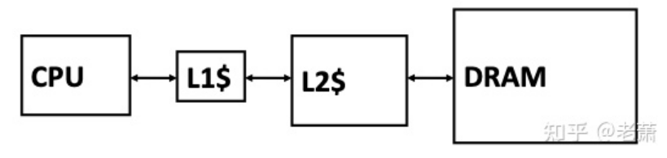

# architecture_store_optimize3

# Contents
- [3.高级优化方法三：多级缓存系统（Multilevel Cache System）](#heading-one)

## 3. 高级优化方法三：多级缓存系统（Multilevel Cache System）

### 3.1 why

存储器技术的限制 ： 一块内存不能做到运行速度块，容量大

*多级缓存的构成*

L1 Cache --> Write Through，容量小。

L2 Cache --> Write Back

### 多级缓存性能 *AMAT*

`AMAT = Hit Time + Miss Rate * Miss Penalty`

`AMAT(L1) = Hit Time(L1) + Miss Rate(L1) * Miss Penalty(L1)`

`Miss Penalty(L1) = AMAT(L2) = Hit Time(L2) + Miss Rate(L2) * Miss Penalty(L2)`

* 本地未命中率（Local Miss Rate） --> L1 和 L2 缓存自身的 Miss Rate
* 全局未命中率（Global Miss Rate）--> 针对一个多级缓存系统，缓存系统未命中的次数 / CPU 访问缓存次数的比值

--> L1 : Global Miss Rate --> 自身的 Miss Rate

--> L2 : Global Miss Rate -> L1 的 Miss Rate * 自身的 Miss Rate

### 多级缓存的包含策略（Inclusion Policies）

--> 描述缓存互相之间如何储存数据

* 1.数据共享 -- Inclusive Multilevel Cache

    * 任何存在 L1 Cache的数据都放在 L2 Cache里
    * 优点：在更大SoC中，外部模块的数据访问只需要访问L2 Cache，因为L1中的数据必定在L2缓存中
    * 如果有数据在 L1 或 L2 Cache 被驱逐，那么数据就会被放回内存，同时更新L1 , L2

* 2.数据独占 -- Exclusive Multilevel Cache

    * L2 Cache 可能会有 L1 Cache 中没有的数据
    * 优点：可以让整个多级缓存系统（Multilevel Cache System）的总容量变大，并且可以最大程度利用缓存的时间局部性（Temporal Locality），因为被 L1 缓存驱逐的数据还会存在 L2 Cache，如果再次用到，不用去内存里再拿数据了
    * 用这种 Policy 需要一种互换操作（Swap Operation），可以在 L1 Cache 和 L2 Cache 之间交换数据

