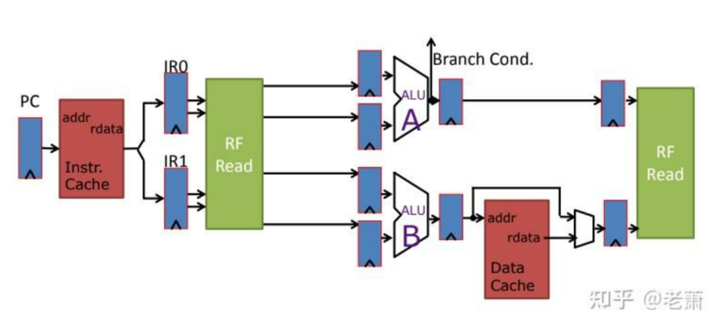

# architecture_store_optimize4

# Contents
- [4.高级优化方法四：高速牺牲缓存（Victim Cache）](#heading-one)
- [5.高级优化方法五：多端口缓存（Multiporting Cache）和分区缓存（Banked Cache）](#heading-two)


## 4. 高级优化方法四：高速牺牲缓存（Victim Cache）

why?

```
int a[1M];

int b[1M];

int c[1M];

for(i=0; i = 1M; i++){
    c[i] = a[i] + b[i];
}

```
如果`c[i], a[i], b[i]`都被索引在一个相同的Cache Line 上，并且是2-Way。 则会有 Conflict Miss。

--> 一块放在缓存边上的额外缓冲区（Buffer）

--> 变相增大缓存的相联性 （Associativity）

--> 减少缓存系统的错失率（Miss Rate）和 错失成本 （Miss Penalty）

### 4.1 特点

--> Cache of Cache . 里面的数据都是原本的Cache中驱逐出来的（Evicted）

*传统缓存系统：*

Evicted Cache Line -> 失效 -> New Cache Line 代替

*Victim Cache:*

Evicted Cache Line -> 存放在 Victim Cache 中

Victim Cache -> 全相联（Fully Associate）, Entries 很少 （4 ~ 16个）-> 通常放置在 L1 缓存旁，俩个缓存可以并行访问（Parallel Checking or Series Checking）


工作原理如图：

* 1. 检查 L1 Cache，如果命中，返回数据

* 2. 没有命中，检查 Victim Cache。如果 Victim Cache 里面有这个数据，则将数据返回给 L1 Cache，再送给处理器。在 L1 Cache 里被驱逐的数据，会放在Victim Cache。

* 3. L1 Cache 和 Victim Cache 都没有该数据，则从主存或下一级Cache中取，放在 L1 Cache里。如果在该次操作里面，L1 Cache 需要驱逐一个数据，那么这个被驱逐的数据会被存进 Victim Cache 里面。任何被 Victim Cache 驱逐的未修改过的数据，都会写进 Memory 里面或者被丢弃

## 5. 高级优化方法五：多端口缓存（Multiporting Cache）和分区缓存（Banked Cache）

why?



* 如果处理器是超标量，比如上图两个 pipe，那么 single-port Cache 只能支持一个 pipe 来运行 Mem 相关的指令（Load & Store），造成 One memory instruction per cycle 的吞吐量瓶颈

* 如何让两个 pipe 都能同时访问内存呢？给 Cache 增加 ports

### 5.1 多端口缓存（Multiporting Cache）—— Bad Idea!


上图的缓存拥有两组 ports，虽然支持多端口的 SRAM 真实存在，但问题随之而来:

* 1.虽然支持两组端口，但缓存的面积增大了两倍，导致访问速度变慢，命中时间（Hit Time）增加

* 2.如果处理器新增了一条流水线，那么这个 Cache 需要三组接口，更难设计；换句话说，这种方案的可扩展性不高

* 3.如果两个 Store 指令在相同的地址存数，或者在相同 Clock Cycle 里面的一个 Load 指令和一个 Store 指令拥有相同的地址，那么会造成冲突，需要额外的硬件和时序来解决

既然不能多加端口，那就把几个缓存拼在一起，组成一个大缓存 ----> 分区缓存


### 5.2 分区缓存 (Banked Cache)


缓存是独立分区的，每一块都有自己的地址空间。系统会利用地址的一部分来选择访问或者写入那一块分区（Bank）。

现代缓存系统吗，采用地址高低位来选择缓存分区：

* 1.数组（Array）拥有着相同的高位地址，如果此时利用高位地址来选择分区，那么数组中连续的元素都会放在同一个分区，从而损伤了性能

* 2.结构数组（Array of Struct）中相同的元素拥有着一样的低位地址，如果此时利用低位地址来选择分区，那么结构数组中相同的元素都会放在同一个分区，连续访问时也会造成性能的下降

`现代处理器中，分区缓存（Banked Cache）都会有一个路由装置（ Router/Crossbar），交替着选择是用地址的高位还是低位，来选取缓存分区，并且确保了每一条流水线都可以访问所有的分区。`

分区缓存带来的挑战：

* 因为需要 Router/Crossbar，所以在设计上会增加难度，系统的功耗和延迟都会增加

* 分区冲突（Bank Conflict）和使用不均匀（Uneven Utilization）的现象依旧存在