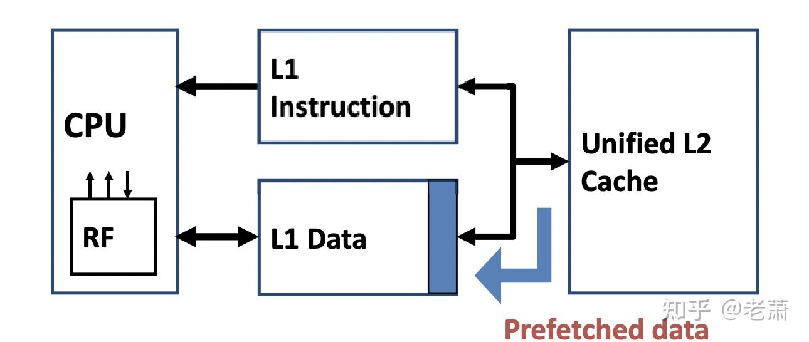
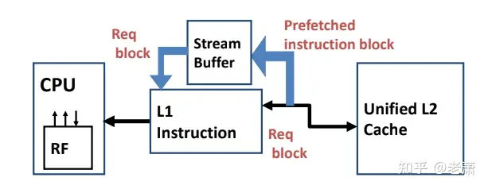
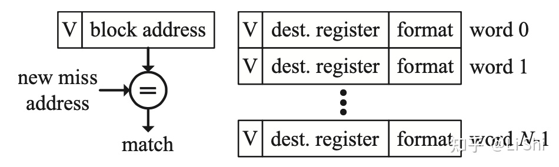

# architecture_store_optimize5

# Contents
- [4.高级优化方法六：缓存预取（Prefetching）](#heading-one)
- [5.高级优化方法五：多端口缓存（Multiporting Cache）和分区缓存（Banked Cache）](#heading-two)


## 6.高级优化方法六：缓存预取（Prefetching）



### why?

--> Capacity Miss (使用更大的缓存) && Conflict Miss （通过更多的相关联性）

`Compulsory Miss`如何解决 -> 添加预取机制从而一开始提前放入程序需要的数据

所以需要有效降低 `Compulsory Miss` 和 `Miss Penalty`

### 预取风险

会对 Capacity Miss 和 Conflict Miss 造成影响 --> 提前拿取的数据没有用上，反而污染了整个 Cache Line

*Prefetch 俩个要点：*

* Usefulness实用性 - 带上来的数据应该被命中

* Timeliness及时性 - 应该在恰到好处的时间点带上来正确的数据；如果太早，会被提早驱逐出去，对性能、功耗、带宽上造成影响，这在 Multi-core 和 Off-Chip 系统里很严重；如果太晚，则预测的数据没有用上，污染了缓存

一般来说，Prefetching 在指令缓存（Instruction Cache）里面很好用，因为通常情况下执行的指令都是按照顺序的，方便预测。并且可以用于一级指令缓存（Instruction L1 Cache） 和二级缓存之间，因为他们是片上系统，可以充分利用带宽。反之，这个机制不用于二级缓存和内存之间，因为一般情况内存都不在片上（Off-Chip），它们中间的带宽十分昂贵。

### 预取器 Prefetcher

三种缓存预取设计：

 1. 硬件指令预取器 Hardware Instruction Prefetcher
 2. 硬件数据预取器 Hardware Data Prefetcher
 3. 软件预取 Software Prefetching

### 硬件指令预取器 Hardware Instruction Prefetcher




Stream Buffer 加入了指令缓存系统，这块 Buffer 可以读取下一条很有可能被执行的指令。整个操作流程如下：

* 假设 CPU 请求了 block i，但未命中

    * 这种情况下，缓存系统会拿取两个 Block

        * block i 放在指令缓存（Instruction Cache）里面

        * block i+1 放在 Stream Buffer 里面

    * 执行完 block i后，CPU 会请求 block i+1 的指令
        * 一级指令缓存中未命中，但 Stream Buffer 命中

        * block i+1 会从 Stream Buffer 里面移到一级指令缓存，接着 Stream Buffer 会读取下一条 block i+2 指令

* （以上假设这段代码中没有 branch 分支）

### 硬件数据预取器 Hardware Data Prefetcher

 三种预测数据方案：

  1. Prefetch-on-miss

 ```
 和上面讲的指令预取器很像，如果 block i 未命中，那么同时拿取 block i+1
 ```

  2. One Block Lookahead (OBL)

```
不管 block i 有没有命中，都拿取 block i+1。那么有很多聪明的小伙伴要问了，这不就是把缓存的块长度（Block Size）翻倍嘛。区别还是有的！如果块长度翻倍，那么在同一时钟周期里面需要拿两个 block，工作量更大，容易引起 Timing Violation；但这个预取器是分步拿取的：拿上来 block i 先用，然后预取器自己再去拿 block i+1, block i+2, ......, block i+n，这样可以将拿取这些块的延迟隐藏起来（hide latency）
```

  3. Strided Prefetch （现代 Intel 处理器使用的方法）

```
以上两种方法都不能解决一个问题：在它们的眼里，数据是连续的，比如 array；但有时数据不是连续的，比如 array of struct，这时我们想连续提取每个 struct 里面相同的元素，就是以固定的 offset 去 array of struct 里面拿数，这时内存的访问就不是连续的了。

所以，我们需要一个更聪明的预取器，以一定的步长（Stride）来拿数。

这个预取器需要能发现一定的规律，比如，如果发现连续两次取数都有 offset N 的偏移量，block i, block i+n, block i+2n，那么，预取器就会自动以这个规律去拿取 block i+3n, block i+4n, ...

Strided Prefetch 还用在了 IBM Power 5 上面，这款处理器有八个独立的 Strided Prefetcher，每一个可以提前拿取 12 个 Block Line。
```

 ### 软件预取 Software Prefetchingz

 利用软件提前取数

 软件预取存在一个很大问题 —— Timing，软件需要在合适的时间拿取合适的数据。但是软件很难知道底层的情况：

 * Programmer 和 Software 不知道真实的底层 Memory load 是多大
 * Programmer 和 Software 不知道 Memory Controller 的阻塞情况
 * Programmer 和 Software 不知道数据 a[i] 和 b[i] 有没有命中
 * 上面这些都是处理器的动态信息，很难把握，所以 Timing 就成为了 Software Prefetching 的一大难题，软件有可能过早或者过晚的拿到了数据，从而污染或者错过了需要的数据

## 7. MSHR (Miss Status Holding Register)

阻塞式缓存 ： L1缓存未命中 --> 整个流水线需等待从更高级缓存或内存中取回数据

实现方式：

### 7.1 implicity addressed MSHR




### 7.2 explicitly addressed MSHR


区别 ： implicity addressed MSHR 每个缓存行只能容纳一条Miss指令，而explicitly addressed MSHR 保存了 block offset

### 7.3 in-cache MSHR

减少保存 MSHR 信息所需的存储量。Tag Array需添加一位 transient bit 来表示当前缓存行是否作为 MSHR 使用